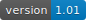

# Website: "Studentischer Sanitätsdienst der TU Dresden"
## Front-End files used for the website of our beloved student group.
### Author: Tom Ziegler
#### Contributers: 

running here: https://unisan-dresden.de

### Current State

There's still a lot of documentation to be done, and code to be cleaned up. 

### Tech

ATM our code requires the following browser capabilities in order to be run and displayed as intended. 

* convincing HTML5 support
* css3
* ECMAScript6 (2015)

A detailed list of required browser capabilities and must-support features is planned to be added soon.

### Dependencies

Our project uses [LESS](http://lesscss.org/) to generate css files.
This project comes with it's own little js framework, which essentially emerged during project development. (Now discontinued here, but used in another project) 

### Usage

Feel free to re-use this code in whichever kind you can think of. You do not need to mention us in any way. However, feel free to send us a link to your project. We would love to see how you could make use of our work.

This repo lacks any images used on our website and refered to in the source. Just replace these these with your images.

### Todos

 A lot...
 
### Contact

For any communication concerning this project, contact us under the following adress:
admin@unisan-dresden.de
 
 

